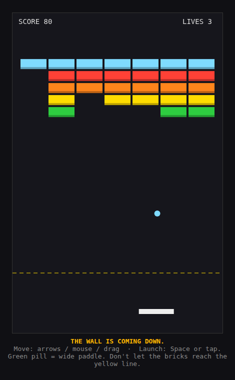
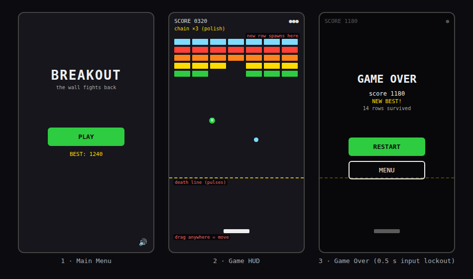
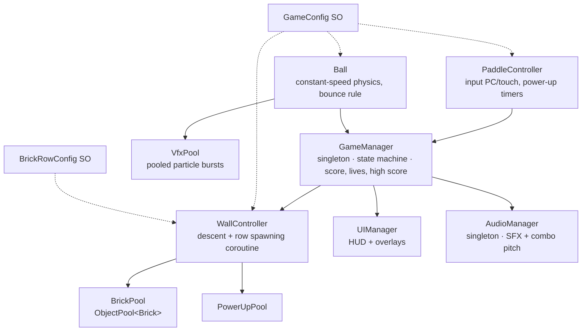

# Breakout
### *The classic — with one twist: the wall fights back.*

| | |
|---|---|
| **Student** | Nitzan Bar-Or (nitzanbaror@gmail.com) |
| **Course** | Unity 101 for CS Students — Final Exercise |
| **The classic** | **Breakout / Arkanoid** (Atari 1976 / Taito 1986): paddle at the bottom, a ball, a wall of bricks. The core rules — paddle, ball, bricks, position-based bounce — are kept; the level structure is the one thing that changes. |
| **The small addition** | There are no levels. The brick wall **descends steadily** and **grows a new row on top** every few seconds — Breakout becomes an endless survival arcade. Let the wall reach the yellow line and it's game over. |
| **Platforms** | **Windows and Android** (MVP) — same project, input adapted per platform (see §4); macOS/WebGL builds are stretch goals |
| **Prototype** | The twist was validated in a playable HTML sketch before this document; the screenshot in §2 is from it. |

---

## 1. Design Pillars

1. **One finger, one mechanic** — the paddle's horizontal position is the *only* input. This rules out: on-screen buttons, aiming, gestures, a second joystick, tilt controls, and any power-up that needs its own button to activate (everything triggers by catching it with the paddle).
2. **The wall is the clock** — all pressure comes from the descending wall, never from timers or countdowns on screen. This rules out: level timers, hand-authored levels, a level-select screen, "hurry up" mechanics, and speeding the *ball* up over time (the ball speed is constant and learnable; the *wall* is what escalates).
3. **Every hit pays** — breaking a brick must always produce feedback: particles, a screen-shake tick, a satisfying sound (rising-pitch combo audio once the polish-phase combo exists). The course's WOW grade punishes lazy games, so juice is a pillar, not a polish item. This rules out shipping any collision that is silent and static.

---

## 2. Reference & Inspiration

- **Primary reference:** *Arkanoid* (Taito, 1986) — [gameplay video](https://www.youtube.com/watch?v=lRuqAjPfKp4). **Taking:** paddle + ball + brick wall, bounce angle controlled by where the ball meets the paddle, falling power-up capsules caught with the paddle. **Not taking:** levels, bosses, enemies flying around, the laser weapon, warp exits.
- **Secondary reference:** the descending-formation pressure of *Space Invaders* (1978) — the wall creeping down is the invaders' march applied to bricks. **Taking:** "the formation coming down IS the difficulty". **Not taking:** shooting, enemies.
- **Feel reference:** [Make it Juicy](https://lonebot.itch.io/make-it-juicy) (Lonebot) — the polish bar this project aims for: same simple base, transformed by feedback. (Shared by the course instructor.)

---

## 3. Core Game Loop

```mermaid
stateDiagram-v2
    [*] --> Menu
    Menu --> Serve: PLAY
    Serve --> Playing: launch (tap / Space)
    Playing --> Serve: ball lost, lives left (-1 life)
    Playing --> GameOver: lives == 0  OR  wall reaches death line
    GameOver --> Menu: tap / Enter (after 0.5 s lockout)
    note right of Playing: wall descends continuously;\nnew row spawns on top every rowInterval
```

**Moment-to-moment rules** — the things that are true every frame:

- **The wall:** while a ball is in play, the whole brick grid moves down at `descentSpeed` — constant, never accelerating. Every `rowInterval` seconds a full new row spawns from the pool **exactly one grid cell (brick height + gap) above the current topmost row**, joining the same moving grid — so row spacing is always identical and new rows inherit the descent. After each spawn `rowInterval` is multiplied by `rowIntervalDecay`, **clamped at `rowIntervalMin`** — the pace tightens toward a fixed maximum pressure, never beyond it. The game must eventually win; the player only decides *when*.
- **Ball speed is constant.** After every bounce the velocity is re-normalized to `ballSpeed`. The single most important control rule: the bounce angle off the paddle is a function of **where** the ball hits it (`t = (ball.x − paddle.x) / (paddle.w/2)`, mapped to an arc of ±60°). This is what turns the paddle from a wall into a aiming tool — without it the game plays itself and the player has no agency.
- A brick dies in one hit (armored 2-hit bricks are a polish item), awards +10, spawns a particle burst, and has a `powerUpChance` of dropping a capsule that falls at `powerUpFallSpeed` and is caught with the paddle.
- **Power-ups (MVP: one; polish: three):** *Wide* — paddle grows to `paddleWideWidth` for `powerUpDuration` seconds (coroutine). Polish adds *Multiball* (+2 pooled balls; life is lost only when the **last** ball drops) and *Laser* — the paddle **auto-fires** pooled bullets upward for the duration (no extra button, per pillar 1); each bullet destroys the first brick it hits — and since the wall's lowest bricks are closest, the leading edge goes first. To be precise: the grid itself never moves back up; the laser buys breathing room by *thinning* the wall's front. It is the panic-button answer to a wall closing on the death line.
- **Scoring (MVP):** +10 per brick, +50 the moment a row's last brick is destroyed. High score persists via PlayerPrefs. No other scoring exists in the MVP.
- **Combo (polish — defined exactly):** a *chain* counts bricks broken since the ball last touched the paddle. Brick N of a chain scores `10 × min(N, 5)` — 10, 20, 30, 40, then 50 per brick, capped. Any paddle touch resets the chain to 1. Laser-bullet kills always score flat 10 and do not advance the chain.
- **Failure:** losing the last ball costs a life → new ball served stuck to the paddle (wall keeps its position — the pressure is not reset). 0 lives, or any brick touching the dashed death line, → GameOver.

### Parameters you will need to tune

| Parameter | What it controls | First guess |
|---|---|---|
| `ballSpeed` | Constant ball speed — the whole game's tempo | 7 u/s |
| `paddleSpeed` / `touchSensitivity` | How fast the paddle tracks input, per platform | 10 u/s |
| `paddleWidth` / `paddleWideWidth` | Base vs. powered-up paddle size | 1.6 u / 2.6 u |
| `bounceArcDeg` | Max deflection angle at the paddle's edge | 60° |
| `descentSpeed` | How fast the wall creeps — the main difficulty dial | 0.08 u/s |
| `rowInterval` / `rowIntervalDecay` | Seconds between new rows, and how it shrinks per row | 11 s / ×0.97 |
| `rowIntervalMin` | Hard floor for `rowInterval` — the pace never tightens past this | 5 s |
| `deathLineY` | Where the wall wins — trades against `descentSpeed` | 3 u above paddle |
| `powerUpChance` | Drop rate per brick | 14 % |
| `powerUpDuration` | How long *Wide* / *Laser* last | 8 s |
| `powerUpFallSpeed` | How catchable capsules are | 2.5 u/s |
| `laserFireRate` | (polish) auto-fire shots per second during *Laser* | 4 /s |
| `comboWindow` | (polish) combo definition | paddle-touch resets |

**Where these live:** a `GameConfig` ScriptableObject (plus a `BrickRowConfig` for row colors/scores). Every value above is Inspector-editable; nothing requires a recompile.

**Feel target:** a first-time player survives 60 seconds within three attempts and understands the descending-wall threat with zero written instructions; a 10-minute player reaches the 15th spawned row. If playtests show players ignoring the wall until it's too late, the fix is the death line's pulse animation, not text.

---

## 4. Controls & Input

| Action | Keyboard / Mouse (PC) | Gamepad | Touch (Android) |
|---|---|---|---|
| Move paddle | **← / →**, **A / D**, or mouse X | — (out of scope) | **drag anywhere** — relative movement, finger never needs to cover the paddle |
| Launch ball / catch restart | **Space** / click | — | tap |
| Pause | **Esc** | — | Android **Back** button; auto-pause on focus loss |

- Input is read in `Update`; the paddle is kinematic and moves in `Update` from the same frame's input (per the course rule, input is never queried in `FixedUpdate`). The ball moves in `FixedUpdate` via `Rigidbody2D` so collisions never tunnel.
- Mouse X and touch-drag use **relative** deltas with a sensitivity setting — no absolute "paddle jumps to finger" teleports.
- A pointer that begins over a UI button is consumed by the `EventSystem` and never reaches gameplay.
- `OnApplicationPause` → auto-pause; resuming runs a 3-2-1 coroutine countdown so nobody loses a ball to a notification.
- Game-over screen: 0.5 s input lockout before restart is accepted.

### PC ↔ Android adaptation plan

One project, one scene, one input script with the touch path compiled under `#if UNITY_ANDROID` pragma flags (Session 6/7). Portrait 9:16 on both (PC letterboxed) — portrait is the natural shape for a descending wall and for thumbs. Canvas per §5 serves both. Per Session 7: `Application.targetFrameRate = 60` is set explicitly on mobile, package name is `com.nitzan.breakout` from day one, UI respects `Screen.safeArea`, and the deliverables are a desktop build **and** a sideloadable `.apk` (IL2CPP + ARM64). The wall's pace (`descentSpeed`, `rowInterval`) is identical on both platforms — difficulty must not depend on the device.

---

## 5. Screens & UI

1. **Main Menu** — logo "BREAKOUT", tagline *"the wall fights back"*, **PLAY**, `BEST: <high score>`, mute toggle. Nothing else.
2. **Game HUD** — `SCORE` top-left, lives as ball icons top-right; (polish) current chain shown under the score only while ≥ 2. The **death line** is drawn in-world as a dashed pulsing line — it is the real UI of the game. **Deliberately absent:** level number, timer, pause button on PC, power-up inventory.
3. **Pause overlay** — translucent; RESUME / RESTART / MENU.
4. **Game Over** — `GAME OVER`, score, best ("NEW BEST" flash when beaten), rows survived, RESTART / MENU.

- **Canvas setup:** one Canvas, Screen Space – Overlay, CanvasScaler *Scale With Screen Size*, reference 1080 × 1920, match 0.5 (exactly the Session 7 pitfall fix). TextMeshPro throughout.

---

## 6. Art & Audio

| Asset | Variants / frames | Source & licence | Use |
|---|---|---|---|
| Paddle, ball, brick sprites | bricks in 6 colors | Kenney *Puzzle Pack* / *Shape Characters*, **CC0** — kenney.nl | core objects |
| Power-up capsules | 3 colors | Kenney *Puzzle Pack*, **CC0** | pickups |
| Particle sprites | 1 square + 1 spark | Kenney *Particle Pack*, **CC0** | brick-break bursts |
| Font | Press Start 2P | Google Fonts, **SIL OFL** | all UI text |
| Music | 1 upbeat loop | Pixabay, **Pixabay Content Licence** | background |
| SFX | bounce, brick break (combo-pitched in polish), power-up, life lost, game over | freesound.org, **CC0-filtered only** | one-shots |

**Licence note:** everything is CC0 / SIL OFL / Pixabay-licensed — free to use and redistribute including in a public build, no attribution required (credited in the README regardless, per Session 8's licensing slide). Nothing from Google Images; no paid Asset Store content, so nothing needs `.gitignore`-ing for licence reasons.

**Technical art rules:** Point (no filter) import, PPU 100, one SpriteAtlas; sorting layers back→front: Background → Bricks → PowerUps → Ball → Paddle → VFX → UI.

**Juice spec (pillar 3):** brick break = particle burst in the brick's color + 1-frame white flash + 0.1 s micro-shake; (polish) chain hits pitch the break SFX up a semitone each; catching a power-up pops the paddle's scale (coroutine lerp, Session 5's exact example); death line pulses faster as bricks get close.

---

## 7. Technical Design

**Scenes:** one — `Game.unity`. Menu / pause / game-over are canvas states driven by the GameManager state machine; RESTART reloads the scene; `GameManager` / `AudioManager` persist via `DontDestroyOnLoad`.

**Packages / systems:** Unity **6.3 LTS** (60000.3.20f1+, per course requirement), built-in 2D renderer, Physics2D (ball `Rigidbody2D` + colliders; bricks/paddle kinematic), TextMeshPro, legacy Input Manager (as taught).

**Target devices:** the dev Windows PC + one physical Android phone. macOS/WebGL builds are polish-phase extras, not MVP.

**Architecture:**

| Script | Responsibility |
|---|---|
| `GameManager` | State machine (Menu → Serve → Playing → GameOver), score/lives, high score, UnityEvents |
| `WallController` | Moves the brick grid down; spawns pooled rows on a coroutine cadence; detects death-line contact |
| `Brick` | Own color/score, dies on hit, requests VFX + maybe a power-up, returns to pool |
| `PaddleController` | PC/touch input, movement clamp, power-up catch + Wide timer coroutine |
| `Ball` | Velocity normalization, paddle-position bounce rule, bottom-out detection |
| `PowerUp` | Falls, applies its effect on catch, returns to pool |
| `UIManager` | HUD + overlays from GameManager events; never polls |
| `AudioManager` | One-shots + combo pitch stepping, music |
| `GameConfig` / `BrickRowConfig` | ScriptableObjects holding every tunable in §3 |

### The course features being implemented

1. **Object pooling** (Session 6, Unity's `ObjectPool<T>`) — **bricks** (a new full row every ~11 s forever — the twist makes pooling load-bearing, not decorative), balls (multiball), power-ups, laser bullets, and particle bursts. Zero gameplay-time allocation → no GC spikes (Session 8's exact lesson) → no dropped frames in a reflex game.
2. **Coroutines** (Session 5) — row-spawn cadence, the Wide/Laser power-up timers, the paddle scale-pop lerp (Session 5's `Lerp` example verbatim), 3-2-1 resume countdown, death-line pulse.
3. **Singletons** (Session 3 pattern, `Awake` guard + `DontDestroyOnLoad`) — `GameManager`, `AudioManager`.
4. **ScriptableObjects** (Session 6) — `GameConfig` + `BrickRowConfig`; every knob in §3 tunable without recompiling.
5. **PlayerPrefs** (Session 6) — persistent high score (and mute setting).
6. **Mobile compilation** (Sessions 6–7) — Android `.apk`, IL2CPP/ARM64, `targetFrameRate = 60`, touch input under `#if UNITY_ANDROID`, `OnApplicationPause` auto-pause.
7. **UnityEvents / observer** (Sessions 3–4) — `OnScoreChanged`, `OnLivesChanged`, `OnStateChanged`; UI and audio subscribe instead of polling.
8. **Gizmos** (Session 6) — editor-only lines for the death line, the row-spawn position, and the paddle clamp bounds.

**Project & repo hygiene (per Session 7's grading notes):** third-party assets live in `Assets/ThirdParty/`; own work in `Scripts / Prefabs / Scenes / Art / Audio`; `.gitignore` includes agent configuration (`.claude/` etc.) and `Library/`; work is committed in small steps with real messages throughout the project, not in one sitting.

---

## 8. Scope

### 8.1 MVP — the game is not a game without these

- [ ] Paddle + ball with the position-based bounce rule, on PC (keys/mouse) and Android (drag)
- [ ] Brick wall that descends and spawns pooled rows on a shrinking interval
- [ ] Death line with pulse feedback; lose on contact or on 0 lives
- [ ] One power-up: Wide paddle (drop, catch, coroutine timer)
- [ ] Score, row-clear bonus, lives, high score via PlayerPrefs
- [ ] Menu / HUD / pause / game-over screens
- [ ] Base juice: particle burst + shake tick + SFX on every brick
- [ ] Windows build **and** installable Android `.apk` at 60 fps

### 8.2 Polish — if the MVP is done and playable

- [ ] Multiball and Laser power-ups (multiball is the pooling showcase; laser auto-fires pooled bullets — no extra button)
- [ ] Combo system (×2 per no-paddle-touch chain) with rising-pitch SFX
- [ ] Armored 2-hit bricks in deeper rows
- [ ] "NEW BEST" celebration; rows-survived stat on game over
- [ ] Android haptic tick on life loss
- [ ] macOS and WebGL builds (in-browser grading convenience)

### 8.3 Explicitly out of scope — we are **not** building these

- Hand-authored levels, a level select, or any campaign structure — the wall *is* the level design
- Multiplayer, online leaderboards, accounts, or any networked service
- Ball-speed ramping or physics randomness — the ball is constant and learnable
- Negative/trap power-ups (shrink, reverse controls) — pillar 1 says catching is always good
- iOS build — Android alone satisfies the mobile requirement
- Any save/persistence beyond PlayerPrefs (high score + mute)
- Bosses, enemies, warp gates, or anything else from Arkanoid beyond bricks, capsules and the laser
- Skins, themes, or a shop

---

## Changelog

| Version | Date | Change |
|---|---|---|
| v0.1 | 2026-09-11 | Initial draft. Descending-wall twist validated in a playable HTML prototype (screenshot in §2). Replaces the earlier STANDSTILL concept. |
| v0.2 | 2026-09-11 | Replaced the *Slow* power-up with *Laser* (auto-fire, pooled bullets) — a dramatic counter to a wall nearing the death line, and a better fit for pillar 1. |
| v0.3 | 2026-09-11 | Title simplified from the working name "BREAKDOWN" to **Breakout**, matching the classic. |
| v0.4 | 2026-09-11 | Review fixes: wall growth specified precisely (rows spawn one grid cell above the topmost row; `rowInterval` clamped at `rowIntervalMin`); combo defined exactly (`10 × min(N,5)` per chain brick) and consistently marked polish; laser wording corrected — it thins the wall's front, never moves the grid up; leftover *Slow* references removed; MVP platforms narrowed to Windows + Android (macOS/WebGL → polish); screen layout sketches added. |
